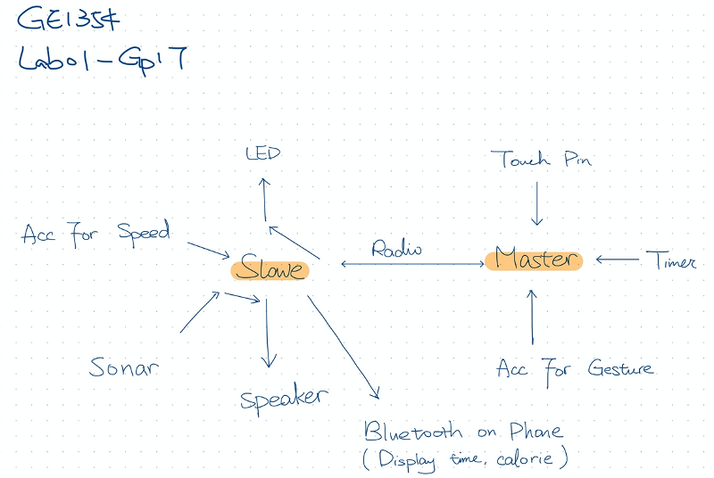
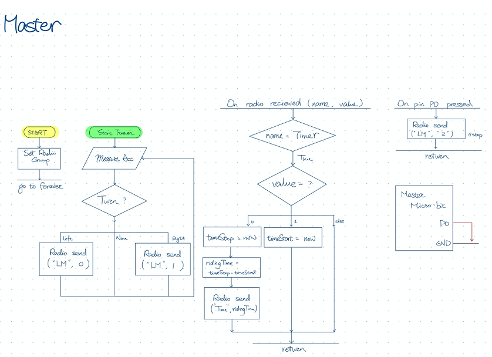
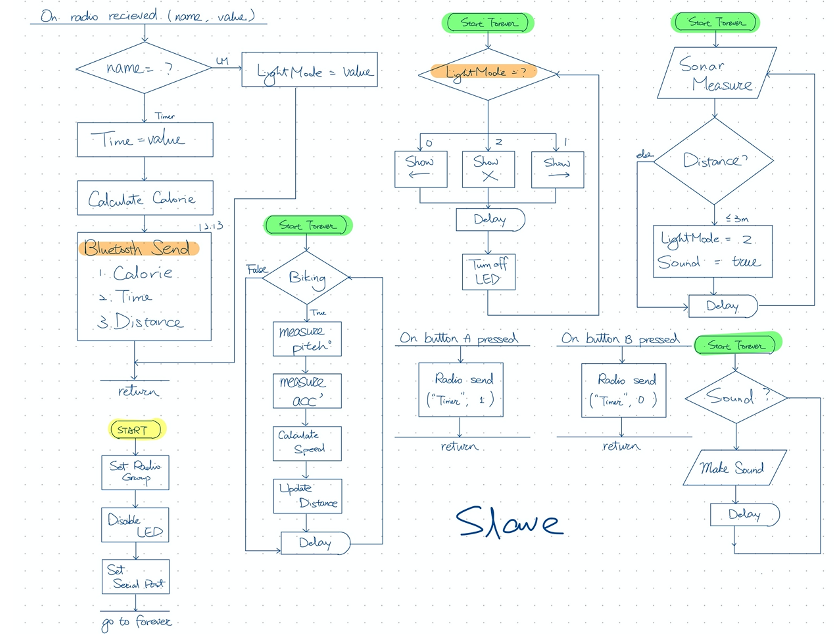
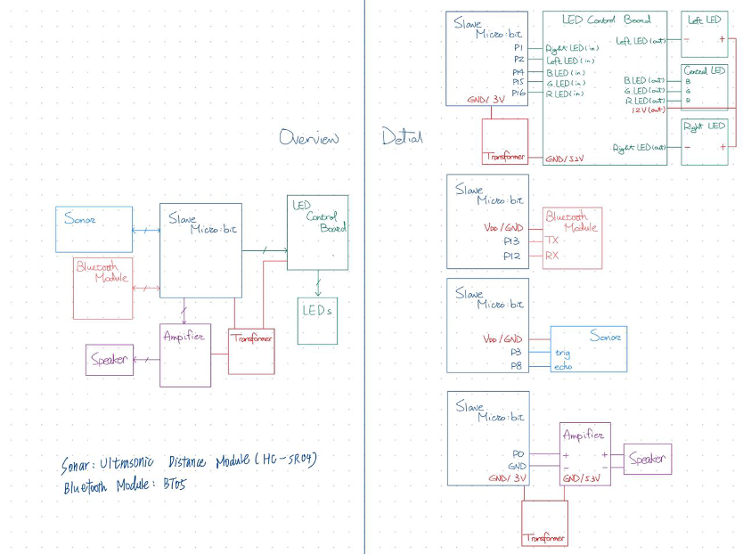
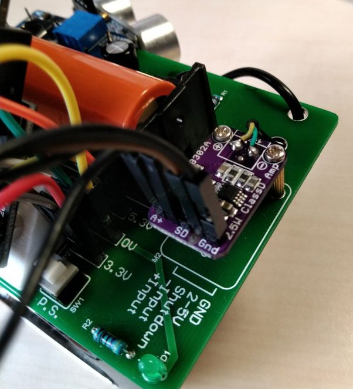
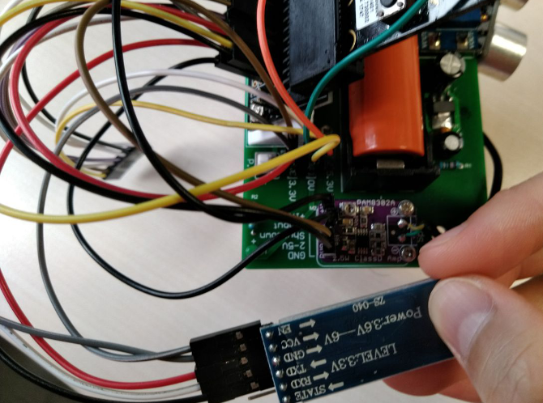
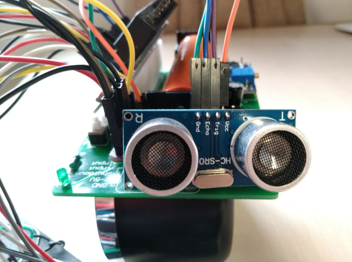
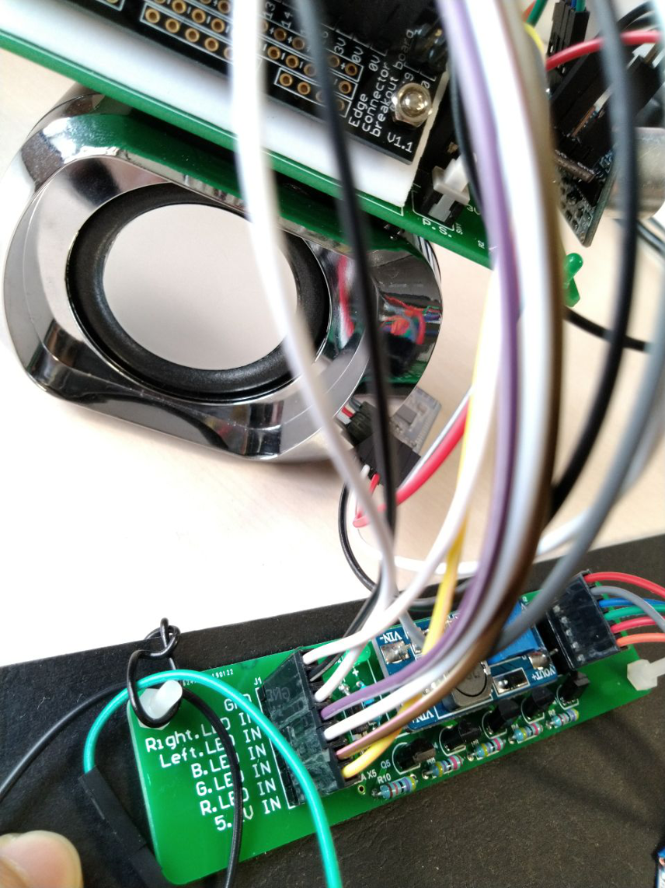
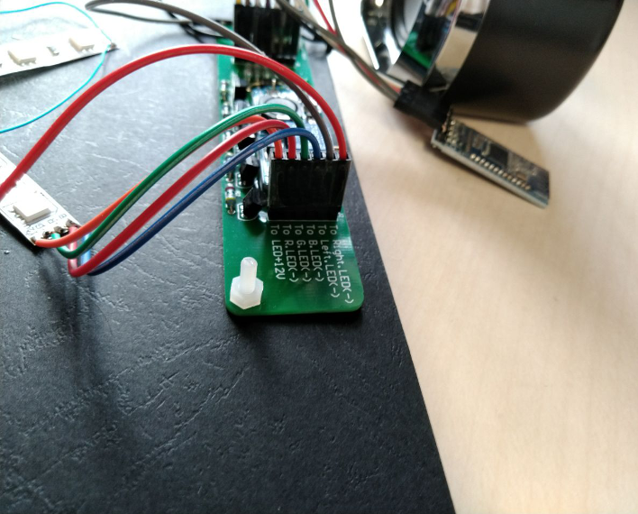
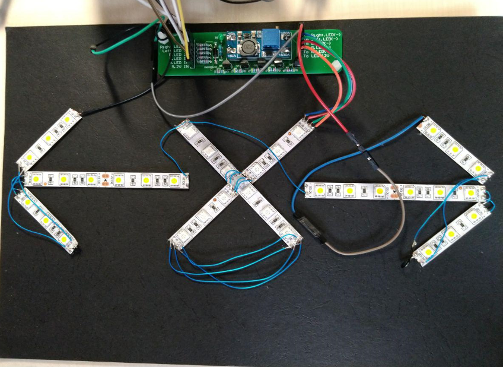

## Project Title

Bike Rider Facilitating System

## Summary

This is a final group project of GE1354 -- Introduction to Electronic
Design at City University of Hong Kong.

Demo1.mov shows the funtion 1, 3, 4 in "Objectives" (See below).
Demo2.mov shows the funtion 2 in "Objectives" (See below).

Our project is to design an auxiliary riding program using micro:bit and
external devices. In real life, riding is a common way of travel. The
main purpose of our procedure is to provide the rider with some
statistic about the riding and help cyclists avoid dangerous situations.

Our program consists of three sets of LEDs, a speaker, a sonar and a
Bluetooth transmission system. The LEDs are used to provide the rider\'s
intention for the vehicle behind the rider. Speaker is used to remind
cyclists and the vehicles behind them that the distance between bicycles
and vehicles is too short now. When cyclist finishes riding, the data of
the whole riding process will be transmitted to the rider\'s mobile
phone through Bluetooth transmission system.

## Introduction

There are four main functions included in our project. The details of
the function are as following:

The first function is the basic requirement, which is the display of LED
lights. Two directional LED arrows will be lit when the rider is given
certain gestures to indicate left/right turns, and there will be another
LED sign display (a cross) when the rider is slowing down (we plan to
use the touch pins to achieve this function).

For the directional LED arrows, we will keep track the micro:bit binding
to the hands of cyclists. When the micro:bit detects an acceleration,
the directional LED arrows will lighten up according to the
acceleration. When the distance measured by sonar is less than 3 meters,
the LED cross will lighten up.

The second function will be distance counting. By using angles and
accumulations of x, y, z, we can get the real acceleration. We use a
physics formula to calculate the distance. After the riding, the result
will be sent to cyclist's cell phone using Bluetooth.

The third function will be time calculating. There will be an on-off
button for the rider to press when he or she starts riding and stop
riding. We will use the micro:bit to get the start riding time and the
end riding time. After calculated the difference between these two
values, the result will also be sent to the cyclist's phone.

The last function will be music playing. By using the speaker and the
distance detect function (which is also used in LED display), music will
be played by the speaker once there is a car that is within 3 meters, to
inform the rider to be cautious while riding. We will use sonar in this
function and keep detect whether the distance is less than 3 meters.
Once the distance is less than 3 meters the LED cross will lighten up
and the speaker will play music.

## Objectives

Our project includes four main functions. They are designed to provide a
safer cycling environment and record some cycling data for cyclists. The
main functions are as following:

1.  LED display according to the rider's gesture.

2.  Distance counting and send the result to a cell phone using
    Bluetooth.

3.  Time calculating to record the riding duration.

4.  Music alarm to prevent the collision.

## Background Theory

Our project has the main function which is the distance measurement and
the only statistic we can use for this part is the acceleration got from
the micro:bit. In order to get the distance, we need to use some
physical theory and mathematical formula.

1.  The Force Decomposition.

When we are riding, we can't guarantee that our micro:bit is placed
horizontally. We need to consider the pitch angle of the micro:bit in
order to get a precise distance. Due to the influence of pitch angle
and gravity acceleration, the acceleration we get from the micro:bit
can't be used directly in our calculation. We need to use the force
decomposition to calibrate the acceleration.
We need to use the addition of vector to show the method of force
decomposition.
This addition method is called the *parallelogram
rule* because **a** and **b** form the sides of
a parallelogram and **a** + **b** is one of the diagonals.
If **a** and **b** are bound vectors that have the same base point, this
point will also be the base point of **a** + **b**.

According to the principle of vector addition, we can decompose a
vector into the sum of two vectors. The angle between the two
decomposition directions we selected is 90 degrees, so we can use the
value of the pitch angle\'s triangular function value in our
calculation.

2.  Physical Formula for Acceleration to Distance

When we get the real acceleration by calibrating the measured
acceleration, we multiply the acceleration with time to get the change
of velocity. By adding this change up with the current velocity, we
will get the new velocity.

Then we multiply the velocity with time to get the distance that the
micro:bit moved in this time period. The formula is S(t) = S~0~ + Vt

The time period we chose is 1/36. That means we will do the distance
calculation 36 times per second in order to guarantee the precision.

3.  The Magnitude of Vector

After we finished the force decomposition, the result we got is the
magnitudes of three mutually perpendicular vectors. In order to get
the magnitude of force after addition, we need to use the Euclidean
Norm.

Euclidean Norm: On an n-dimensional Euclidean space Rn, the intuitive
notion of

length of the vector x = (x1, x2, \..., xn) is captured by the formula

In this case, we use the 3-dimensional Euclidean space. The length of
the vector **a** can be computed with the Euclidean norm

When we use this formula in distance calculation, given points
(*x*~1~, *y*~1~, *z*~1~) and (*x*~2~, *y*~2~, *z*~2~) in three-space,
the distance between them is:

4\. Simple Moving Average

When the cyclist is riding, there may be some vibration that will
cause an error in our calculation. The up and down vibration will
increase the calculation result if we just use the distance calculated
by the latest calculation in our program. In order to decrease the
error caused by vibration, we use the moving average to calculate the
acceleration.

In science and engineering, the mean is taken from an equal number of
data on either side of a central value. This ensures that variations
in the mean are aligned with the variations in the data rather than
being shifted in time. 

In our program, we will save the latest 20 acceleration value and use
the average value of these 20 accelerations to calculate the distance.
In this way, we can avoid the shifting induced by using only the
latest acceleration.

## Hardware and Software Design

Note: Figures and flowcharts are provided in Section 5, while the
descriptions are listed and explained in Section
6.

**Figure 1: Overall of Design**

**Figure 2: Software Design of Master**

**Figure 3: Software Design of Slave**

**Figure 4: Hardware Configuration of Slave**

## Principle of Operation

**Operating Principle of Software**

The two micro:bits, referring to master and slave in the above diagrams,
are placed in different position. Master is being placed on the rider's
hand, and Slave is being placed in the back of the bike. There is no
other external device connected to Master, while the main purpose of
Master is letting the rider to indicate which direction the bike will
go. On the other hand, Slave is connected to four external devices,
including sonar, speaker, LED control board, and bluetooth module.

Master measures the rotate angle and whether or not pin 0 is touched to
decide what "LightMode" should be send to Slave. When it received "Timer
= 1", it will mark down the time, to compute the time measured at "Timer
= 0". The data that are communicated between them are being transferred
in radio send. Such data includes LightMode value, sent from Master to
Slave, and Timer ,sent from Master to Slave.

The four external devices connected to Slave serve for different
purpose. Ultrasonic Distance Module, short as Sonar, helps keep track of
the distance between the car and the bike.The speaker will display sound
if a close distance is detected. The LED control board is connected to 3
different kinds of LED output, including left arrow, right arrow and a
central cross. Different outputs correspond to the different value of
"LightMode". The bluetooth module, BT05, connects Slave and mobile phone
together, and send the results measured at Slave to the mobile phone
interface. Results sent include total riding time, calories that the
rider consumed, and riding distance. The overall riding time, the time
difference between Button A and Button B is pressed. Calories are
measured using the overall riding time and bike riding calories formula.
Riding distance is calculated based on the continuous counting of
accelerometer. These values are sent to a mobile phone via the bluetooth
connection between the phone and the external bluetooth module.

**Operating Principle of Hardware**

The connections between Slave and other external devices need to be
considered carefully, since different modules require different
connection. We plug Slave into a breakout board to make connection
between the micro:bit and the external devices easier.

Connection between Speaker and Slave is simple, since we only need to
plug the corresponding pin onto the chip that is on top of the Speaker.
Speaker contains 4 pins, including A- (connected to 0V on the breakout
board), A+ (connected to pin 0), GND (connected to 0V on the breakout
board), Vcc (connected to 3V on the breakout board ).

**Figure 5: Speaker Connection**

The external bluetooth module include 5 pin connection, including RXD
(connected to pin 12), TXD (connected to pin 13), GND (connected to GND
on the breakout board), Vcc (connected to Vcc on the breakout board))
and EN ( connected to the 3.3V pin on the battery).

**Figure 6: BT05 Connection**

Both Sonar and LED control board require a high supply voltage, which
can be provided by the pin on the battery. Sonar includes four pins,
including Echo (connected to pin 8), Trig (connected to pin 3), GND
(connected to 0V pin on the battery)and Vcc (connected to 5.3V pin on
the battery).

**Figure 7: Sonar Connection**

LED control board include 6 pins, including Left LED (connected to pin
2), Right LED (connected to pin 1), R LED (connected to pin 14), G LED
(connected to pin 15), B LED (connected to pin 16), GND (connected to 0V
pin on the battery) and Vcc (connected to 5.3V pin on the battery).

**Figure 8: LED Control Board Connection with Breakout Board**

On the right side of the LED control board, there are also 6 pins that
need to be connected to the LEDs on the board. The pins have same names
with the left ones, the only difference between them is the role. Left
pins obtain voltage from the battery, and right pins provide these
powers to the LEDs.

**Figure 9: Right pins on LED Control Board**

**Figure 10: Connection of LEDs**

## Analysis and Discussion

After we finished our design, we tried to measure different distance
using our function. For short distance and long distance, the results
are as our expected. The error is small if we start walking immediately
after pressing the button. But we found that if we keep the micro:bit
static after pressing the button and wait for a minute. The micro:bit
will show a distance of about 10 meters. This theoretically contradicts
the function we designed because after we calibrate the acceleration,
the acceleration value in each direction should be zero when it is
static.

In order to find the cause of the error, we let the micro:bit shows the
real-time acceleration in each direction. We found that although the
micro:bit is static, it detected a little acceleration in each
direction. There are two reasons may lead to this error: The first is
the acceleration measured by micro:bit may not be precise. So, it will
detect a little acceleration although it is static. The second reason is
more likely to be the real cause of the error. As the acceleration has
been calibrated by calculation using trigonometric function and gravity
acceleration, the error may occur in the calibration part. The gravity
acceleration we used is 9.8099 m/s^2^ which is the gravity acceleration
value of Hong Kong. This value may differ from the real acceleration
value. Also, the measured pitch angle and trigonometric function values
of this angle may have an error. Although the error in acceleration is
small, the error it causes will accumulate over time. It is impossible
to increase the precision of the micro:bit acceleration measurement. In
order to eliminate this error, we add a threshold to the acceleration.
If the absolute value of the acceleration is less than the threshold
value, it will be ignored and won't be calculated in our program. After
we tried 90 different values between 0.01 to 0.1, we chose 0.035 as our
threshold. Using this value, the measured distance can keep zero when
the micro:bit is static and the error for moving cases are also small.

The performances of other functions are quite satisfactory. The LEDs
perform well in every situation and the speaker can play the music when
there are items within three meters of the micro:bit.

## References

The parallelogram rule:
[[https://en.wikipedia.org/wiki/Euclidean\_vector]{.underline}](https://en.wikipedia.org/wiki/Euclidean_vector)

Euclidean Norm:
[[https://en.wikipedia.org/wiki/Norm\_(mathematics)\#Euclidean\_norm]{.underline}](https://en.wikipedia.org/wiki/Norm_(mathematics)#Euclidean_norm)

Distance calculation formula:
[[https://en.wikipedia.org/wiki/Distance]{.underline}](https://en.wikipedia.org/wiki/Distance)

Moving Average:
[[https://en.wikipedia.org/wiki/Moving\_average]{.underline}](https://en.wikipedia.org/wiki/Moving_average)
